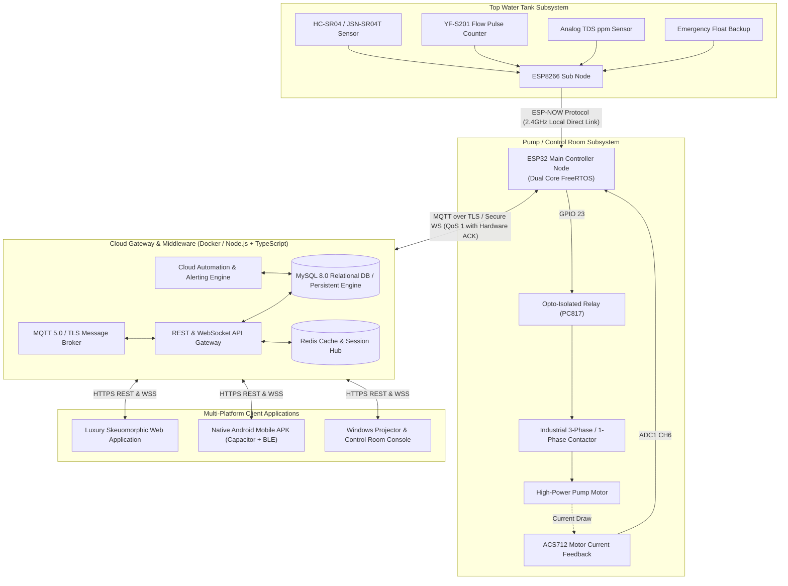

# 01 — Complete System Architecture & Topology

## 1. System Vision
The **Smart IoT Water Pump Control & Telemetry Platform** is an enterprise-grade industrial automation ecosystem. It solves the critical reliability challenges in residential, agricultural, and commercial water management:
1. **Zero-Internet Local Operation**: The system continues automated filling, dry-run safety lockouts, and tank monitoring even if cloud connectivity is completely severed.
2. **Dual-Microcontroller Hierarchy**: 
   - **ESP8266 Sub Node**: Low-power, tank-top sensor telemetry acquisition node.
   - **ESP32 Main Node**: Industrial edge controller driving opto-isolated contactor switches, running FreeRTOS automation tasks, BLE provisioning, and MQTT/TLS telemetry relay.
3. **True Real-time Multi-Platform Synchronization**: Web, Android Mobile APK, and Windows Projector / Control Room display receive 50Hz sub-second telemetry and hardware state confirmation ACKs.

## 2. High-Level Architecture Diagram

## 3. Data Flow Progression
1. **Sensor Acquisition (ESP8266)**: Measures time-of-flight distance, pulse count, and analog TDS voltage every 2000ms.
2. **Local Transmission (ESP-NOW)**: Packages payload with sequence number, magic byte `0xAA`, and CRC16 checksum. Unicasts to ESP32 Main Node.
3. **Edge Rule Evaluation (ESP32)**: FreeRTOS Core 1 evaluates local safety rules (low water start, high water stop, dry-run zero inflow trip).
4. **Hardware Actuation**: Triggers opto-isolated relay to pull down contactor coil. Reads current feedback from ACS712.
5. **Cloud Telemetry Relay**: FreeRTOS Core 0 publishes JSON telemetry payload to MQTT topic `devices/{device_uid}/telemetry`.
6. **Real-time Client Broadcast**: Cloud backend ingests packet, persists to database, and broadcasts over WebSocket (`/ws`) to all connected Web, Android, and Windows clients without page reload.
