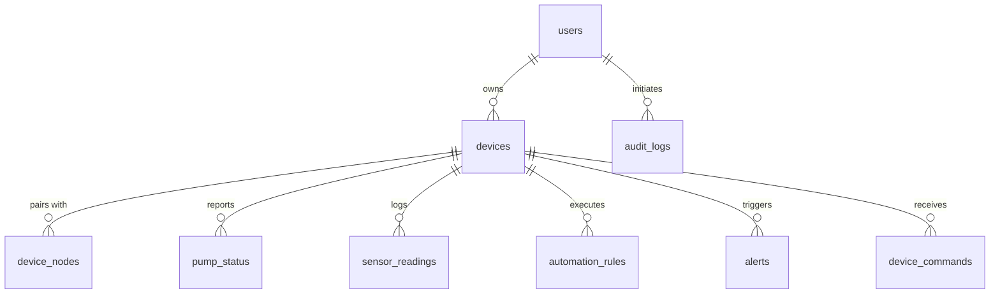

# 04 — Database Schema & Relational Models

## 1. Schema Overview
The database layer is designed for high-throughput time-series telemetry ingestion, multi-tenant device ownership, audit traceability, and edge automation synchronization.

### Entity Relationship Diagram

## 2. Table Specifications

### 1. `users`
| Column | Type | Constraints | Description |
|---|---|---|---|
| `id` | VARCHAR(36) | PRIMARY KEY | UUID v4 |
| `name` | VARCHAR(100) | NOT NULL | User full name |
| `email` | VARCHAR(191) | NOT NULL UNIQUE | User email address |
| `phone` | VARCHAR(30) | NULL | Optional phone |
| `password_hash` | VARCHAR(255) | NOT NULL | Bcrypt salted hash (10 rounds) |
| `role` | ENUM | admin, operator, viewer | Role Based Access Control |
| `status` | ENUM | active, inactive, suspended | Account status |
| `created_at` | DATETIME | CURRENT_TIMESTAMP | Registration timestamp |

### 2. `devices`
| Column | Type | Constraints | Description |
|---|---|---|---|
| `id` | VARCHAR(36) | PRIMARY KEY | Device internal ID |
| `device_uid` | VARCHAR(64) | NOT NULL UNIQUE | E.g. `WPC-A81F29` |
| `serial_number` | VARCHAR(64) | NOT NULL UNIQUE | Factory hardware serial |
| `owner_id` | VARCHAR(36) | FK -> users(id) | Associated user ID |
| `status` | ENUM | online, offline, degraded, provisioning | Controller status |
| `firmware_version` | VARCHAR(20) | DEFAULT 'v1.0.0' | Active firmware |
| `tank_capacity_liters`| DECIMAL(10,2)| DEFAULT 1000.0 | Total tank volume |
| `tank_height_cm` | DECIMAL(10,2)| DEFAULT 150.0 | Height of tank chamber |

### 3. `pump_status`
| Column | Type | Description |
|---|---|---|
| `pump_state` | ENUM | `OFF`, `ON`, `FAULT`, `STARTING`, `STOPPING` |
| `mode` | ENUM | `MANUAL`, `AUTOMATIC`, `SCHEDULED`, `EMERGENCY_STOP` |
| `runtime_seconds`| INT | Continuous running time |
| `current_draw_amps`| DECIMAL(6,2) | Motor current from ACS712 |
| `changed_by` | VARCHAR(100) | `USER`, `LOCAL_AUTOMATION_RULE`, `SAFETY_INTERLOCK` |

### 4. `sensor_readings` (Time-Series Telemetry)
| Column | Type | Description |
|---|---|---|
| `water_level_percentage`| DECIMAL(5,2) | 0.0 - 100.0% |
| `water_level_liters` | DECIMAL(10,2) | Calibrated volume |
| `inflow_rate_lpm` | DECIMAL(8,2) | Flow rate from YF-S201 |
| `total_inflow_liters` | DECIMAL(12,2) | Accumulated totalizer |
| `tds_ppm` | DECIMAL(8,2) | TDS sensor reading |
| `temperature_c` | DECIMAL(5,2) | Water temperature |
