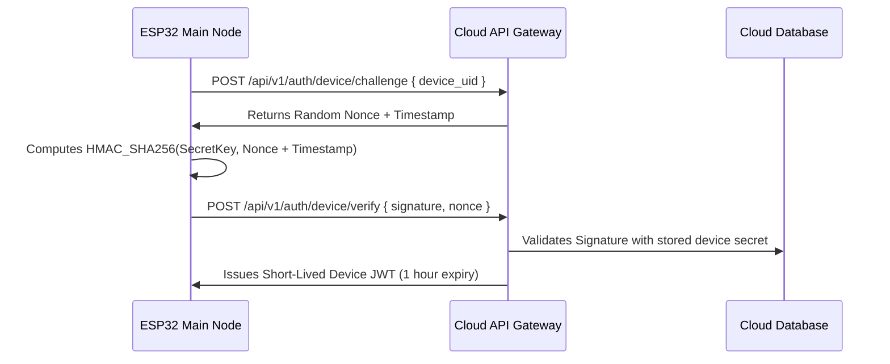

# 06 — Hardware Authentication & Security Guide

## 1. Zero-Trust Hardware Identity
Every physical ESP32 Main Node controller is provisioned at the factory with:
1. **Immutable Device UID**: E.g. `WPC-A81F29` (derived from MAC and factory serial).
2. **Device Secret Key**: Stored in protected ESP32 Non-Volatile Storage (NVS) flash with Flash Encryption enabled.
3. **Hardware HMAC-SHA256 Challenge-Response**:

## 2. Best Practice Security Constraints
1. **No Universal Secrets**: No universal master key is ever hardcoded into firmware binaries.
2. **Encrypted Flash (AES-256-XTS)**: ESP32 hardware flash encryption is enabled to prevent dumping NVS memory over JTAG or UART.
3. **Secure Boot v2**: RSA-3072 / ECDSA signed bootloader ensures only authorized firmware updates can execute on the hardware.
4. **Transport Layer Security (TLS 1.3)**: All MQTT and REST traffic is encrypted in transit.
5. **Role-Based Access Control (RBAC)**: Only `admin` and `operator` roles can issue pump actuation commands. `viewer` role can only inspect live telemetry.
