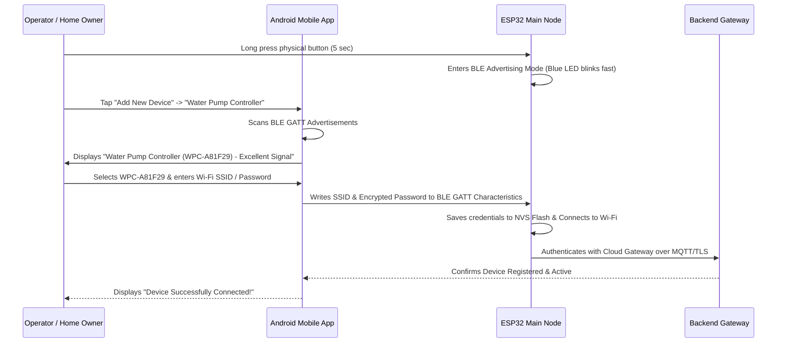

# 07 — BLE & Wi-Fi Device Provisioning Guide

## 1. Provisioning Workflow
The device provisioning process delivers a seamless commercial smart-home experience:

## 2. BLE Custom GATT Service UUIDs
- **Service UUID**: `0000ffff-0000-1000-8000-00805f9b34fb`
- **Characteristic UUIDs**:
  - `0000fff1-0000-1000-8000-00805f9b34fb`: Device Identity (Read)
  - `0000fff2-0000-1000-8000-00805f9b34fb`: Wi-Fi SSID (Write)
  - `0000fff3-0000-1000-8000-00805f9b34fb`: Wi-Fi Password (Write)
  - `0000fff4-0000-1000-8000-00805f9b34fb`: Server URL (Write)
  - `0000fff5-0000-1000-8000-00805f9b34fb`: Provisioning Status (Read/Notify)
